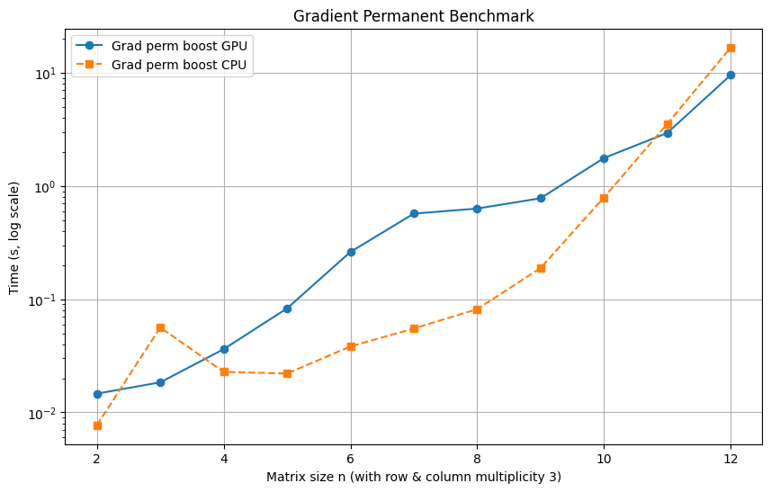
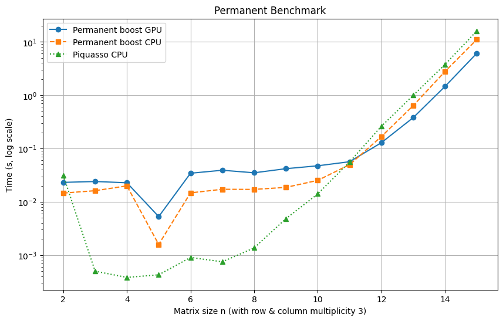

[](https://pypi.org/project/permanentboost/)  [](https://github.com/0xSooki/permanent-boost/actions)  [](LICENSE)

# Permanent Boost

Efficient, parallelized computation of the matrix permanent and its gradient for photonic quantum computing simulations, supporting both CPU and GPU execution.

## Overview

**PermanentBoost** is a high-performance Python library for computing the permanent function and its gradient — a key component in simulating photonic quantum circuits like Boson Sampling. The library provides optimized CPU and CUDA-enabled GPU backends and integrates seamlessly with machine learning frameworks like JAX.

It is implemented in C++/CUDA and exposed via Python using `pybind11` and XLA FFI bindings for full interoperability with JAX.

## Features

- 🔬 Efficient matrix permanent computation
- 🔁 Gradient support for use in QML
- ⚡ CPU & GPU acceleration
- 🧪 Comprehensive test suite
- 📦 Easy installation via pip
- 🔄 JAX-compatible bindings for auto-diff workflows

## Installation

### Requirements

- Python 3.10 / 3.11 / 3.12
- pip
- OpenMP (Linux/macOS) or equivalent
- Optional: NVIDIA GPU with CUDA support

### Quickstart

```bash
git clone https://github.com/0xSooki/permanent-boost
cd permanent-boost
pip install .
```

To use the GPU backend:

```bash
pip install "jax[cuda12]"
```

## Usage

### Python API

```python
from permanent import perm
import numpy as np

A = np.array([...], dtype=np.complex128)
rows = np.array([1, 1, 1], dtype=np.uint64)
cols = np.array([1, 1, 1], dtype=np.uint64)

# Compute permanent
result = perm(A, rows, cols)
```

### Gradient (with JAX)

```python
import jax
from permanent import perm

grad_fn = jax.grad(perm, holomorphic=True)
gradient = grad_fn(A, rows, cols)
```

## GUI (Optional)

Run the PyQt5 interface for demonstration:

```bash
python app/main.py
```

## Benchmark Results

  


- GPU implementation outperforms CPU and existing libraries at matrix sizes ≥ 11
- Gradient computation shows significant speedup on CUDA-enabled devices

## Troubleshooting

## Development

```bash
pytest  # Run tests
pytest --platform=gpu  # Run GPU-specific tests
```

### Build Wheels for Distribution

CI/CD pipelines are configured via GitHub Actions. Wheels are built for macOS, Windows, and Linux.

## License

This project is licensed under the MIT License.

## Citation

If you use this library in academic work, please cite the corresponding bachelor thesis:

> Bence Soóki-Tóth. "Efficient calculation of permanent function gradients in photonic quantum computing simulations", Eötvös Loránd University, 2025.
